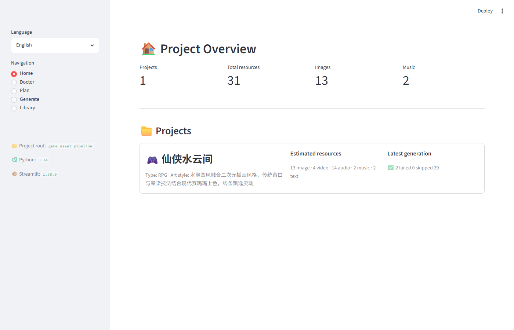
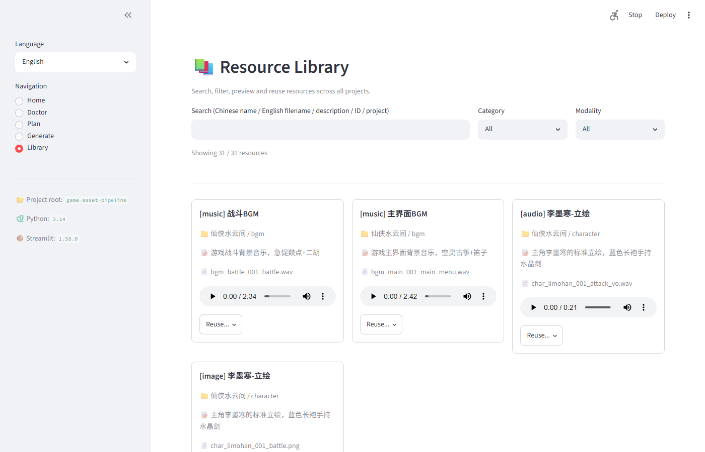
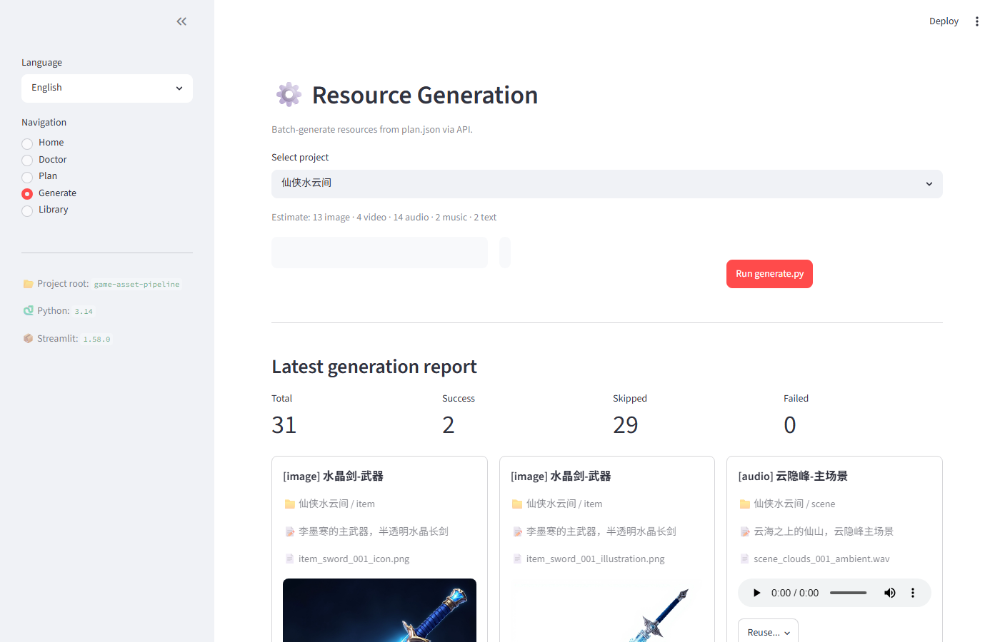
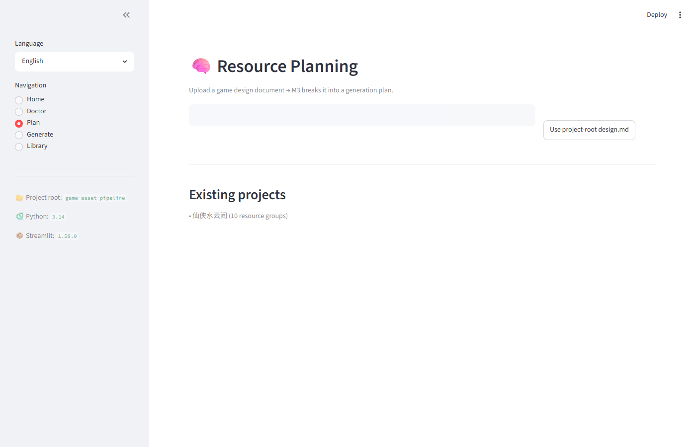
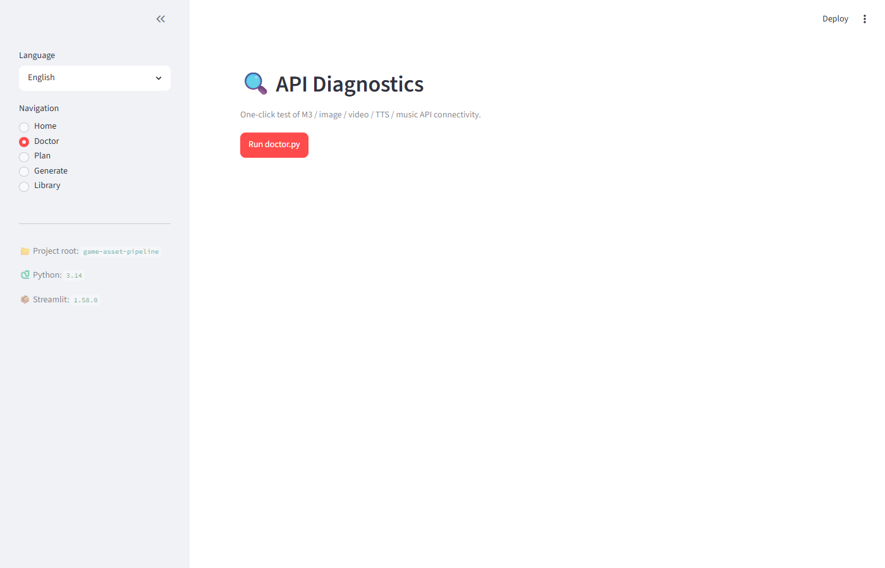
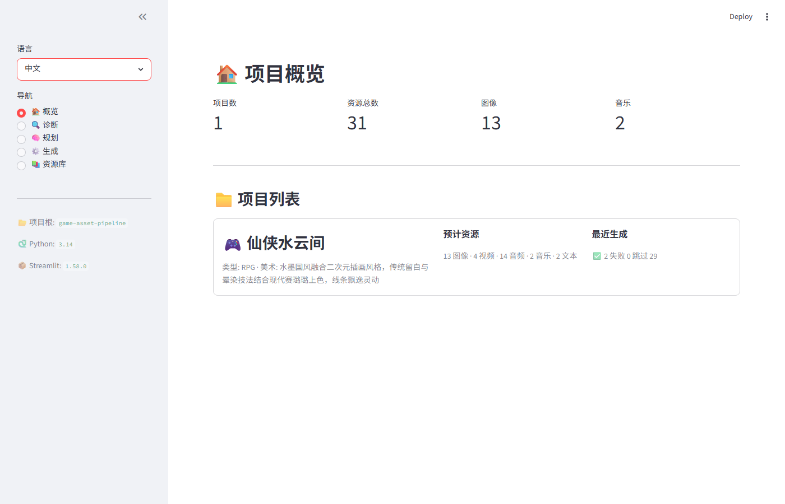

# 🔥 AI Asset Forge

> **AI 生成的美术资源不必一次成型。它们会演化、分叉、生长——像一棵家族树。**
>
> AI Asset Forge 是游戏资产生成器 + 资源库 + 版本图，为没有美术团队的单人开发者和想用 AI 提效的美术作者设计。当前用 MiniMax / M3 实现，但设计上是模型后端可插拔的。

[](LICENSE)
[](https://www.python.org)
[](https://streamlit.io)


[English README](README.md) · [快速开始](#-快速开始) · [路线图](#-路线图) · [核心想法](#-核心想法资源有家族树)

---

## 🎯 这是给谁用的？

**你没有美术团队，但你有想法。**

两类用户：

1. **不会画画的程序员** — 逻辑能写，资源画不出来。想要一个工具，把设计文档变成资源、把资源管起来、跨项目复用。
2. **想用 AI 提效的美术作者** — 你会画原创，但想让 AI 帮你做变体。你画一张，让 AI 生十几个变体；挑好的，fork 出来继续改。久而久之你的个人风格就在一棵演化树里展开。

两类用户最后撞上同一个问题：**资源太多，不知道哪个从哪个来的，迭代过程一锅粥**。AI Asset Forge 就是给这两类人用的。

---

## ✨ 特性

### 已实现
- **从设计文档生成规划** — 拖一个 `.md`/`.txt` 进去，M3 拆解成结构化资源清单（角色/场景/技能/UI/道具/BGM/SFX）
- **全模态批量生成** — 图像、视频、TTS 语音、器乐、文字一锅端，并发、重试、超时都处理好
- **SFX 智能裁剪** — ffmpeg 的 `silencedetect` 找自然结束点 + `afade` 加淡出，不硬切
- **全局资源索引** — SHA256 去重，按中文名/英文文件名/描述/ID 搜索，缩略图 + 内嵌音频/视频预览
- **跨项目复用** — 一键把任意资源复制到别的项目
- **i18n** — 英文（默认）和中文，sidebar 一键切换
- **CLI + GUI 都有** — 每个 UI 页面背后都是一个 CLI 脚本

### 核心想法（见 [路线图](#-路线图) 查进度）
- **每个资源有家族树** — 每个资源都记住它的"父"（产出它的原图/prompt）和"子"（fork 出去的变体）。整个资源库是一张可导航的图。
- **可视化树视图** — 可以平移缩放，左右或上下浏览，像 族谱 / GitKraken commit 图。点任一节点看它的祖宗、后代、当初的 prompt 和种子图。
- **Fork、精修、共享** — 团队里谁看到一个不错的资源，可以 fork 出来再喂给 AI 一遍，结果作为子节点传回去。优秀的变体自然积累。
- **AI 资源 + 手动导入混在一起** — 直接拖你画好的 PNG/JPG/MP3 进去。它就是图里的一个普通节点，跟 AI 生成的无差别。没有"AI vs 手绘"的人为分裂。

---

## 🌱 核心想法：资源有家族树

AI 生成很少一次到位。一个好资源是**迭代**出来的——原画 → AI 改 → 再 AI 改 → 分叉出几个变体 → 挑一个 → 继续改。

AI Asset Forge 把每个资源都当成**演化图**里的一个节点：

```
                        ┌─────────────┐
                        │  original   │  ← 你画的，或 AI 第一版
                        │  hero_idle  │
                        └──────┬──────┘
              ┌──────────────────┼──────────────────┐
              ▼                  ▼                  ▼
       ┌──────────┐       ┌──────────┐       ┌──────────┐
       │ battle-1 │       │ portrait │       │ idle-v2  │
       │ damage   │       │ close-up │       │ new pose │
       └────┬─────┘       └────┬─────┘       └──────────┘
            │                  │
       ┌────┴─────┐       ┌────┴─────┐
       ▼          ▼       ▼          ▼
   ┌────────┐ ┌────────┐ ┌────────┐ ┌────────┐
   │ on-fire│ │ rainy  │ │ wounded│ │ smiling│
   └────────┘ └────────┘ └────────┘ └────────┘
     (fork)      (fork)     (fork)      (fork)
```

每个节点都带：
- **资源文件**（PNG、MP3 等）
- **产出它的 prompt**（或手动导入时你的备注）
- **父节点引用**（它从哪个资源派生来的）
- **生成元数据**（模型、seed、参数、时间戳）
- **标签**（方便搜索）

你可以：
- 点任一节点看它完整的"祖宗链"（prompt + 种子图一路回溯）
- 看团队里谁 fork 了你的作品、怎么改的
- 同时往多个方向分叉，事后再挑赢家
- 像 git 一样回滚到任一历史版本

树视图会做平移缩放，左右或上下浏览，参考 GitKraken commit 图和传统 族谱。

---

## 📸 截图

### 概览 — 一眼看所有项目


### 资源库 — 搜索、筛选、预览、复用


### 生成 — 选项目、配参数、跑


### 规划 — 上传设计文档，让 M3 拆解


### 诊断 — 一键 API 健康检查


### 英文界面


> **即将到来**（mockup）：可平移缩放的**资源家族树**视图。

---

## 🚀 快速开始

### 1. 安装

需要 **Python 3.10+**。

```bash
git clone <your-fork-url>
cd game-asset-pipeline
pip install -r requirements.txt
```

### 2. 配置后端

```bash
cp config/minimax.json.example config/minimax.json
# 编辑 config/minimax.json
```

具体填什么看 [后端](#-后端) 章节。现在唯一可用的后端是 **MiniMax**。需要一个或两个 key：

| Key | 用途 | 哪里拿 |
|---|---|---|
| `api_key`（Token Plan） | 图像/视频/TTS/音乐（扣积分） | [MiniMax 订阅 / Token Plan 页面](https://api.minimaxi.com) |
| `payg_api_key`（PAYG） | M3 文本规划（按 token 计费） | MiniMax PAYG 页面 |

只买了 Token Plan 的话，`payg_api_key` 留空即可——M3 文本调用会自动 fallback 到 `api_key`。

### 3. 启动 UI

```bash
streamlit run app.py
```

浏览器自动打开 `http://localhost:8501`（默认绑 127.0.0.1，看 [`.streamlit/config.toml`](.streamlit/config.toml)）。Windows 也可以双击 `start.bat`。

### 4. 第一个项目，端到端走一遍

1. **🔍 诊断** 页 → 点 "Run doctor.py"，确认 5 个 API 都能连通
2. **🧠 规划** 页 → 点 "Use project-root design.md"（或上传自己的）→ 点 "Run plan.py"。M3 分析 4-8 分钟
3. **⚙️ 生成** 页 → 选刚生成的项目 → 勾选要跳过的模态（比如 `video` 因为配额少）→ 点 "Run generate.py"。第一次跑 5-10 分钟
4. **📚 资源库** 页 → 搜索、筛选、预览、复用

### 5. 只用 CLI

```bash
python scripts/doctor.py
python scripts/plan.py path/to/design.md
python scripts/generate.py 你的项目名 --skip video
python scripts/index.py --rebuild
python scripts/index.py --search "李墨寒"
```

---

## 🔌 后端

生成器是按**后端可插拔**设计的，方便以后扩展，不绑定任何一家模型厂商。

| 后端 | 状态 | 能干啥 |
|---|---|---|
| **MiniMax**（M3 + Token Plan） | ✅ 已实现 | 文本规划（M3）、图像（`image-01`）、视频（`Hailuo-2.3`）、TTS（`speech-2.6-hd`）、音乐（`music-2.6`） |
| **Stable Diffusion**（本地） | 🔜 计划中 | 图像、img2img 变体——隐私友好、免费、离线 |
| **DALL-E / GPT-4o** | 🔜 计划中 | 图像生成 |
| **ComfyUI 工作流** | 🔜 计划中 | 你自定义的流水线 |
| **本地 checkpoint**（SD / Flux / ...） | 🔜 计划中 | 任何能本地跑的模型 |

想加一个？见 [贡献](#-贡献)——后端接口设计得很小。

---

## 🗂 路线图

**愿景**就是上面的家族树。当前实现是地基。优先级（大概）：

| 优先级 | 特性 | 原因 |
|---|---|---|
| ✅ 完成 | 多后端生成（MiniMax） | 地基——资源得先存在才能有树 |
| ✅ 完成 | 资源库索引 + 搜索 + 复用 | 地基——得能找得到资源 |
| ✅ 完成 | SFX 智能裁剪 | 打磨——更好用的 SFX → 更有用的树 |
| 🔜 下一个 | **资源谱系图** | 核心想法——每个资源带 `parent_id`；CLI 能查祖宗链 |
| 🔜 下一个 | **手动导入资源** | 直接拖 PNG/JPG/MP3 进来，成为一等节点 |
| 🔜 下一个 | **树视图** | UI 里可平移缩放的图 |
| ⏳ 之后 | **后端可插拔** | SD / DALL-E / ComfyUI / ... |
| ⏳ 之后 | **从已有资源派生** | "同一个角色但着火"——用现有资源做种子再喂 AI |
| ⏳ 之后 | **资源版本控制** | 每次保存都是一次 revision，可回滚、对比、打 tag |
| ⏳ 之后 | **团队共享** | fork 别人的资源，贡献回去 |
| 💭 想法 | **用你自己的成品做风格迁移** | 拿你完成的作品教 AI 你的风格 |

> 想影响优先级？开 issue 说说，或边用边告诉我们缺啥。

---

## 🔧 怎么工作的

```
┌─────────────────────────────────────────────────────────────┐
│                                                              │
│  design.md / prompt ─► AI 后端 ─► 新资源 (child of X)        │
│                                           │                  │
│                                           ▼                  │
│              assets/  ◄──  版本存储  +  谱系 DAG             │
│                       │                                      │
│                       ▼                                      │
│                index.json + parent_id 链接                   │
│                       │                                      │
│                       ▼                                      │
│            Streamlit UI  +  树视图  (计划中)                 │
│                                                              │
└─────────────────────────────────────────────────────────────┘
```

| 脚本 | 作用 |
|---|---|
| `scripts/doctor.py` | 一次性检查所有后端连通性 |
| `scripts/plan.py` | 把设计文档发给文本后端，拿到结构化 `plan.json` |
| `scripts/generate.py` | 读 `plan.json`，批量调 API，下载 + 改名 + 入库（带 `parent_id`） |
| `scripts/index.py` | 扫所有项目，建可搜索的 `index.json` |
| `app.py` | 包了上面 4 个脚本的 Streamlit UI |
| `i18n.py` | en / zh 翻译字典 + `t()` helper |

完整结构见 [项目结构](#-项目结构)。

---

## 🗂️ 项目结构

```
game-asset-pipeline/             ← 本地目录名（GitHub 仓库可以重命名）
├── app.py                       # Streamlit UI 入口
├── i18n.py                      # en / zh 翻译
├── start.bat                    # Windows 启动器（防卡邮箱引导）
├── requirements.txt
├── LICENSE                      # MIT
├── README.md / README.zh.md     # 本文件
├── .streamlit/
│   └── config.toml              # 绑 127.0.0.1:8501
├── config/
│   ├── minimax.json.example     # 模板（提交进 git）
│   └── minimax.json             # 你的真 key（gitignore 掉）
├── prompts/
│   ├── resource-planner.md      # M3 系统 prompt（中文，默认）
│   ├── resource-planner.en.md   # M3 系统 prompt（英文）
│   └── modality-prompts/        # 预留：各模态 prompt
├── scripts/
│   ├── doctor.py
│   ├── plan.py
│   ├── generate.py
│   └── index.py
├── templates/
│   └── project-template.json    # 测试用示例 plan
└── docs/
    └── screenshots/             # README 截图
```

`assets/projects/<项目名>/` 在 `.gitignore` 里——这是你自己生成的内容，不该当源码提交。

---

## ⚙️ 配置项参考

`config/minimax.json` 字段（未来会变成后端专属）：

| 字段 | 必填 | 说明 |
|---|---|---|
| `api_base` | ✓ | 通常 `https://api.minimaxi.com` |
| `api_key` | ✓ | Token Plan Key — 图像/视频/TTS/音乐 |
| `payg_api_key` | 否 | PAYG Key 给 M3 文本用（空则 fallback 到 `api_key`） |
| `group_id` | 否 | 部分端点需要 |
| `models.text` | ✓ | 默认 `MiniMax-M3` |
| `models.image` | ✓ | 默认 `image-01` |
| `models.video` | ✓ | 默认 `MiniMax-Hailuo-2.3`（Max 套餐每天 3 次） |
| `models.tts` | ✓ | 默认 `speech-2.6-hd` |
| `models.music` | ✓ | 默认 `music-2.6` |
| `output_dir` | ✓ | 项目产出位置（相对仓库根） |
| `max_concurrent` | ✓ | 并发 API 调用数（视频 ≤2，其他可调高） |
| `retry_times` | ✓ | 临时失败重试次数 |

---

## 🌍 国际化

UI 支持 **英文**（默认）和 **中文**，sidebar 一键切换。

加新语言：
1. 打开 `i18n.py`
2. 在 `LANGS` 字典里加一项，key 跟 `"en"` 一样，value 翻译
3. 在 `language_picker()` 里加标签

漏翻译的 key 会回退到 key 本身，UI 上能直接看到该补的词。

M3 规划 prompt 也是双语：`prompts/resource-planner.md`（中文，默认）和 `prompts/resource-planner.en.md`（英文）。改文件名切换，或改 `scripts/plan.py` 里的路径。

CLI 脚本（`scripts/*.py`）默认打印中文。要英文直接改源码就行——每个脚本都很短。

---

## 🧰 排错

**`doctor.py` 全报 `1004 login fail`** → `api_key` 错了或留空，编辑 `config/minimax.json`。

**`doctor.py` 报 `usage limit exceeded, daily usage limit reached for Token Plan Max (3/3 used)`** → 视频生成最耗积分，低档套餐每天就 3 次。加 `--skip video` 明天再试，或者升套餐。

**`plan.py` 5 分钟超时** → M3 对超长设计文档很慢。文档精简点，或在 `scripts/plan.py` 里把 `timeout=300` 调大。

**`generate.py` 报 `invalid params, lyrics is required`** → 不该再出现了，我们总是传 `is_instrumental: true`。碰到了开个 issue。

**Streamlit 报 `ModuleNotFoundError: No module named 'streamlit'`** → `pip install -r requirements.txt`。

**资源库里音频播不了** → 打开浏览器控制台看报错。文件是按字节流嵌入的，MIME type 走 magic number 探测，文件坏了会显示 "Audio playback failed: …"。

**`imageio-ffmpeg` 第一次跑有 warning** → 正常，第一次会下载静态 ffmpeg 二进制。后面就没了。

---

## 🤝 贡献

欢迎 PR。最想要的：
- **新后端** — 后端接口设计得很小，专为可插拔而生
- **树视图** — d3 / vis.js / react-flow / 你顺手哪个都行
- **i18n 翻译** — en / zh 之外的任意语言
- **现有脚本的测试**

几个注意点：
- **别把 `config/minimax.json` 提交** — 里面有真 API key，`.gitignore` 已经排除
- **加新 i18n key 时，`en` 和 `zh` 都要补**（`i18n.py`）
- **CLI 脚本是 source of truth**，Streamlit 只是薄壳。改完先用 CLI 测一遍
- **提 PR 前跑一次 `python scripts/doctor.py`**，确认你本地环境没问题

---

## 📜 License

MIT — 见 [LICENSE](LICENSE)。
